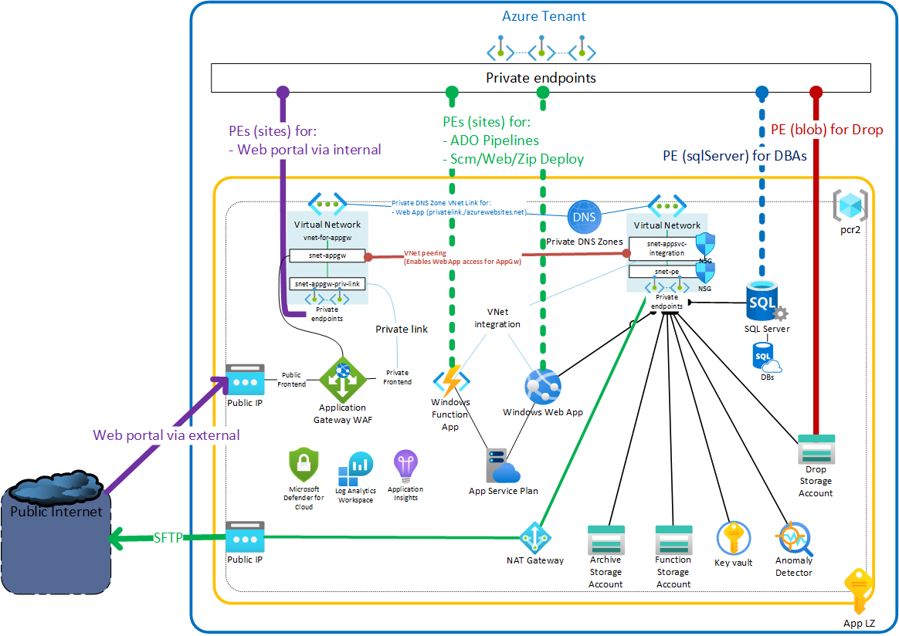

# PCRv2-PoC

## Overview

The code in this repo was created to support a Proof Of Concept validating a target architecture of an application named PCR moving from IIS to Azure PaaS.

The main objectives the new architecture supports are:

- Completely isolate the processing pieces of the Application from external non-direct dependencies. We called it the "app runs in an island",

- Deploy a fully secured system in the island that is protected against external attacks,

- Deploy in an architecture where the Application can run, even if "external" services outages, like Active Directory Directory Services, on-premises systems, etc. happen,

- Provide this level of isolation, WITHOUT deploying a dedicated Application Service Environment v3. Just by leveraging a shared App Service with locking down features,

- Create a platform pattern that can be used for all Windows Server / IIS to Azure PaaS Development services migrations projects,

- Provide High-Availability, leveraging PaaS built-in features, and preparing for multi-region availability.

## Architecture diagram



Notes:

- External Private endpoints in strong continuous lines are required system inputs:

  - Access to the Web portal via internal network,
  - Access for the external system to drop files to process,

- External Private endpoints in dashed lines are optional and for administrative purposes (they can be created, used, then deleted):
  - Access to the scm endpoint of the Function App, for app deployments,
  - Access to the scm endpoint of the Web App, for app deployments,
  - Access to the Azure SQL server management, for management.

## Repository content

The repository contains:

- an `azure/` folder with all the `terraform` files required to deploy the Azure resources/infrastructure:

  - `azure/pcr2-poc-resources/`: is the folder with the variables and main files for terraform. To run the terraform, a `<values whatever name>.auto.tfvars` file is required with the values set for these variables:

    ```
    # Terraform Service Principal
    tenant_id       = "" # <= Tenant Id of the tenant to deploy into
    subscription_id = "" # <= Subscription Id of the subscription to deploy into
    client_id       = "" # <= Terraform service principal Id to use by terraform azurerm provider
    client_secret   = "" # <= Terraform service principal secret to use by terraform azurerm provider

    # Prefixes for App Subscription
    main_region_code = "use2" # <= Region code to use. See /terraform/modules/base/locals.tf to select/add a code
    subsc_nickname   = "poc"  # <= Any nickname for the subscription
    subsc_adm_short  = "eb"   # <= Any other abbreviation

    # Access to External subscription
    external_snet_pe_id = "" <= The external subnet Id to connect the Island to through Private endpoints

    # SFTP User
    sftp_user_name = "" # <= The user name to connect to the external SFTP site
    sftp_user_pwd  = "" # <= The user password to connect to the external SFTP site

    # External facing Web App URL
    external_url  = "" # <= The FQDN for the Public/external facing endpoint of the Web portal
    tls_cert_path = "" # <= The local file path to the PFX (including private key) of the TLS certificate for the Web portal
    tls_cert_pwd  = "" # <= The password to open the PFX file
    ```

  - `azure/terraform-modules/`: is the folder with multiple re-used terraform modules by the `main_pcr2-poc.tf` file

    The modules are:
    - `base/`: this module enforces naming conventions for the resources,
    - `rg/`: Creates a Resource Group,
    - `pe/`: Creates 1 Private Endpoint,
    - `pe-dns/`: Creates eventual CNAME and A records for the Private Endpoints.

- a `src/` folder with:

  - `src/WebApp1/`:

    A Web Application with the following characteristics:
    - `.NET core 6.0 LTS`,
    - `no containers`,
    - `Razor Pages`,
    - `Microsoft.Data.SqlClient`,
    - `EntityFrameworkCore`,
    - `EntityFrameworkCore.SqlServer`,
    - `Microsoft.Identity.Web`,
    - `Azure.AI.AnomalyDetector`,
    - `Azure.Storage.Blobs`.

    It demonstrates the following technical patterns:
    - Azure `Storage Account Blobs/Containers` access and data manipulation through `Private endpoints` and `Managed Identity`,
    - `EntityFrameworkCore` access to `Azure SQL Server and database` through `Private endpoints` and `Managed Identity`,
    - Changing User Interface based on:
      - Database access availability,
      - Authenticated user or not (at logout),
    - Integration with `Application Service Authentication` provider to:
      - Allow access only to `Azure AD/Entra ID` authenticated users,
      - Gather User token from `token store`,
    - Use of `Azure AI Anomaly Detector` from `Razor pages` using `.NET core` code to detect data anomalies (`Univariate` option),
    - `Publish` from `Visual Studio 2022` to the `Windows Web App` through `Private endpoints` with both `Web` and `Zip` deploy profiles.

  - `src/FunctionApp1/`:

    A Windows Function App with the following characteristics:
    - `.NET core 6.0 LTS`,
    - `no containers`,
    - `Microsoft.Data.SqlClient`,
    - `EntityFrameworkCore`,
    - `EntityFrameworkCore.SqlServer`,
    - `Azure.Storage.Blobs`,
    - `Microsoft.NET.Sdk.Functions`,
    - `WinSCP` (SFTP .NET client).

    Providing the following `Functions` demonstrating:
    - `WhatIsMyIP`:
      - This function uses a `httpClient` to query a service to get its Public Internet Address,
      - It logs the result and allows to check that all calls to Public Internet are done through the Azure `NAT Gateway` attached to the `App Service Integration VNet`,

    - `InputFilesProcessor`:

    - `QueryDatabase`:

    - `SftpClient`:

